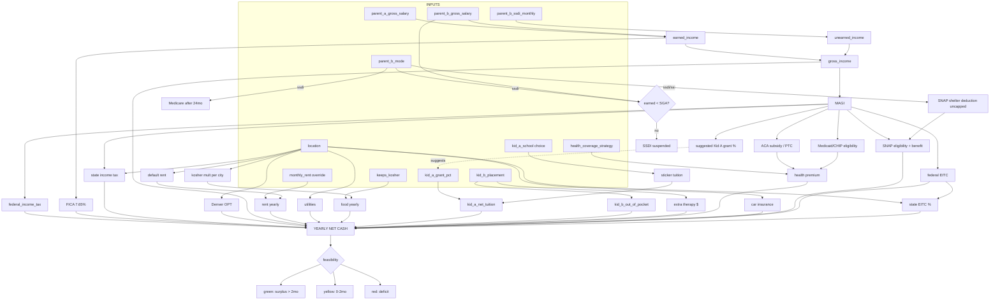
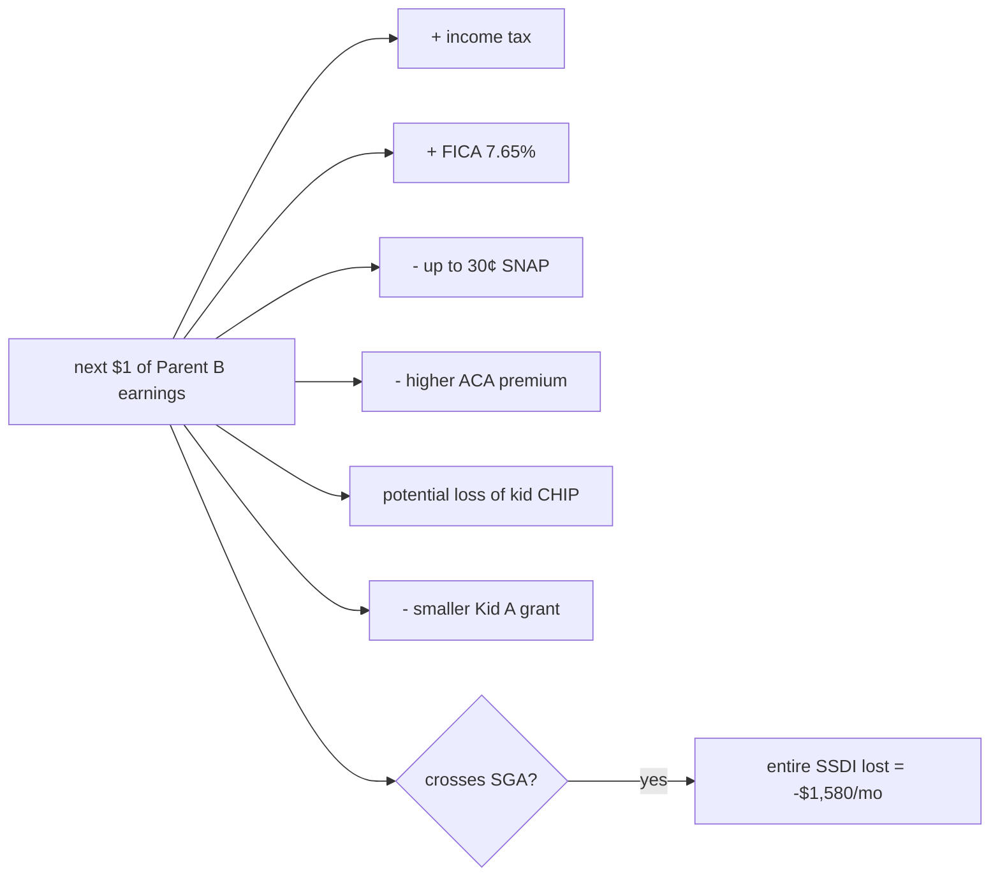

# Dependency Graph

High-level flow of how user inputs propagate into the yearly-cost output.

## The core cascade in words

1. **User sets income + disability + location.**
2. Income composes to gross → MAGI.
3. MAGI + location jointly determine every tax.
4. MAGI is also the eligibility key for ACA, Medicaid/CHIP, SNAP, grants, EITC.
5. Location sets expenses (rent, utilities, car insurance, food mult).
6. Disability status overrides several rules (Medicare, SNAP uncapped shelter, Katie Beckett for Kid B).
7. Schooling choices add big fixed expenses.
8. Sum → yearly net cash → feasibility flag.

## The interesting coupling — "the cliff"

When Parent B's work pushes MAGI across one of these thresholds, the **effective marginal tax rate often exceeds 100%** — earning more makes them poorer. This is the central insight the simulator must make visible.
